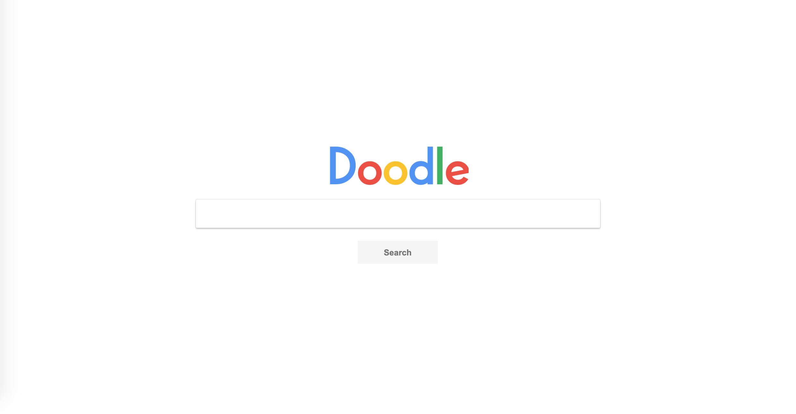
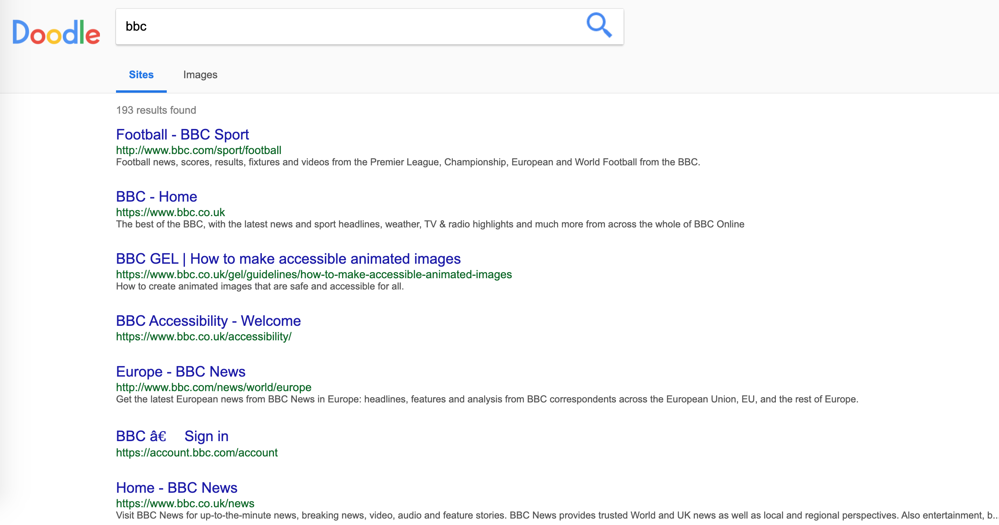
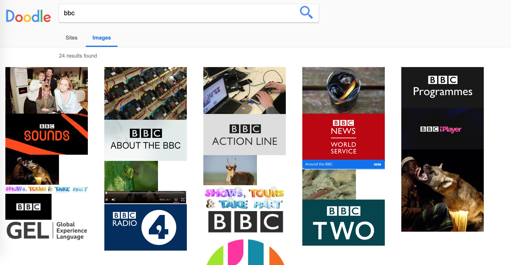

# Google Clone Full-Stack Website
Site created with HTML5, CSS3, JavaScript (with AJAX), PHP, & MySQL

## Table of contents
* [Screenshots](#screenshots)
* [General info](#general-info)
* [Technologies](#technologies)
* [Live Demo](#live-demo)
* [Status](#status)
* [Contact](#contact)
* [TODO](#TODO)

## Screenshots 

## General info
Fun project to experiment more with PHP, MySQL, JavaScript & AJAX. Found this tutorial on Udemy and thought it would be a great learning experience to build. 

Pretty much the site is a Google clone and crawls other web pages like bbc.com, google.com, apple.com and others to retrieve information to index in the MySQL database. Then you can search this site, just like Google, to retrieve both links and images to your search.

## Technologies
* HTML5, CSS3, JavaScript (with AJAX), PHP, & MySQL

## Live Demo
View live demo here: [Demo](https://doodleibz.000webhostapp.com/)

## Status
Incomplete

## Contact
Created by [Ibsaa J Adam](https://github.com/ibsaajadam) - feel free to contact on:
You can find me also on:
* [Linkedin](https://www.linkedin.com/in/ibsaajadam/)
* [Github](https://github.com/ibsaajadam)

## TODO

* Learn more about crawling other sites for data and add more data to display. 
